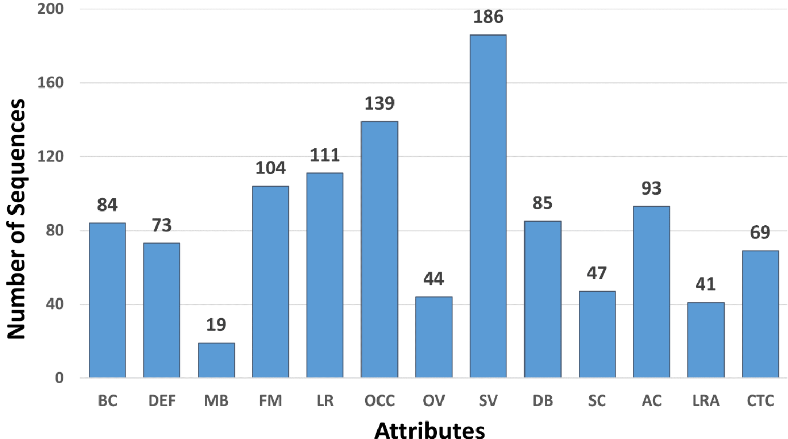
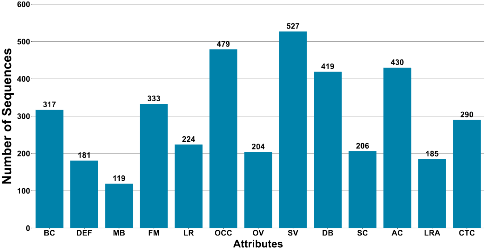
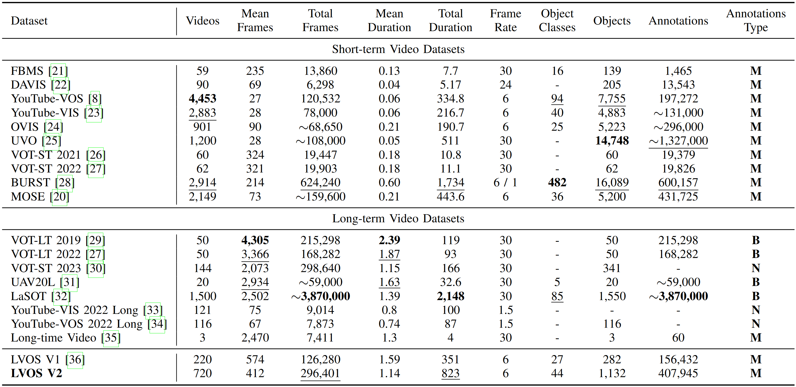

# Notes on LVOS and LVOS 2
- Both datasets (LVOS and LVOS 2) propose videos that tackle the specific Long Term Video Object task.
- They present attibutes for both datasets (link issue here).

## Attributes: 
### List of Attributes:
| Attribute | Definition |
| --------- | ---------- |
| **BC**  | *Background Clutter*: The appearances of background and target object are similar.
| **DEF** | *Deformation*: Target appearance deform complexly.
| **MB**  | *Motion Blur*: Boundaries of target object is blurred because of camera or object fast motion.
| **FM**  | *Fast Motion*: The per-frame motion of target is larger than 20 pixels, computed as the centroids Euclidean distance.
| **LR**  | *Low Resolution*: The average ratio between target box area and image area is smaller than 0.1.
| **OCC** | *Occlusion*: The target is partially or fully occluded in video.
| **OV**  | *Out-of-view*: The target leaves the video frame completely.
| **SV**  | *Scale Variation*: The ratio of any pair of bounding-box is outside of range [0.5,2.0].
| **DB**  | *Dynamic Background*: Background undergos deformation.
| **SC**  | *Shape Complexity*: Boundaries of target object is complex.
| **AC**  | *Appearance Change*: Significant appearance change, due to rotations and illumination changes.
| **LRA** | *Long-term Reappearance*: Target object reappears after disappearing for at least 100 frames.
| **CTC** | *Cross-temporal Confusion*: There are multiple different objects that are similar to targect object but do not appear at the same time.

### Distribution of Attributes:
- **LVOS v1**  
    *Taken from the LVOS v1 paper*
    

- **LVOS v2**  
    *Taken from the LVOS v2 paper*
    

## Datasets statistics:
*Taken from the LVOS v2 paper*

